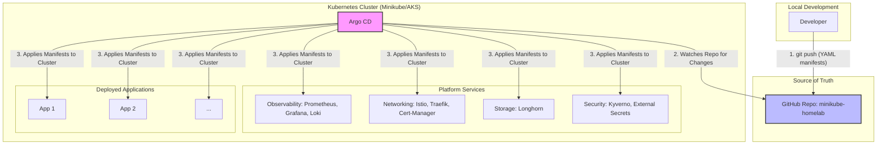

# Home Lab Architecture

This document outlines the target architecture for this Kubernetes home lab project. The entire system is designed around a GitOps workflow, where the GitHub repository is the single source of truth.

## Architecture Diagram

The diagram below illustrates the flow of configuration from the developer to the live applications running in the cluster.

## Workflow

1.  **Commit & Push:** The platform engineer (or developer) makes all configuration changes—from deploying a new application to updating a security policy—by committing YAML manifests to the `minikube-homelab` Git repository.
2.  **Argo CD Sync:** Argo CD, running inside the Kubernetes cluster, continuously monitors the repository. When it detects a change, it automatically pulls the new configuration.
3.  **Deploy:** Argo CD compares the desired state from the Git repository with the actual state of the cluster and applies the necessary changes to bring the cluster into alignment. This ensures that the Git repository is always the single source of truth.
